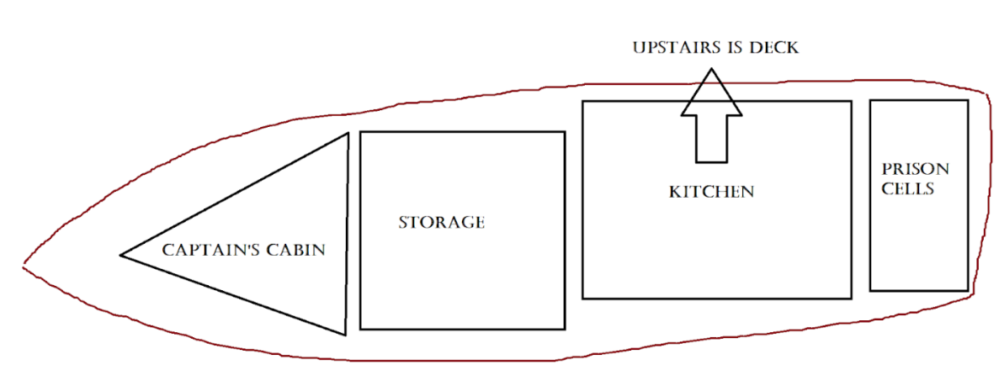

# buccaneer-boat
A text adventure game about being held captive on a pirate ship. Made in APCS

Run on Eclipse console.

# Plot summary:
You wake up and find yourself captured by a giant pirate ship called “The Buccaneer Boat”, and the captain has locked you up in the prisons. It’s up to you to navigate through the ship, in search for something to convince the captain to let you go, or to escape the ship through a smaller boat.

# Walkthrough:
## Rooms:
Prison cell: The prison cell is a medium-sized murky room with water dripping down all sides, and the sound of the ocean sloshing the sides as the giant ship moves. There are inmates all around you in seperate cells, each looking less human than the last. The prisoners are all extremely thin, and many of them are missing teeth, fingernails, or even some limbs. Your neighboring inmate is an old man, around 80, with a silver tooth. He peers at you through the prison bars. You can also see a bottle of rum, a small string, even a golden compass on the ground in your adjacent cell. Guard, map also present

Kitchen: As you walk into the kitchen, smells come from every angle, with food present at every table. You can see the crew on some tables, hounding away at scraps of food like scavengers. Giant barrels line the wall, along with a locked vault presumably containing loot. You see a chicken leg on the nearest table, and a lone oar beside it. 

Storage room: The storage room is filled with supplies cramped up everywhere, like cannonballs, gunpowder, sugar, water, and clothing. At the end of the hallway, you see a very decorated door, with crystals encrusting every inch, and a large golden lock to it. Beside you is one cannonball, and a whole bag of sugar.

Captain’s cabin: The captain’s cabin is a spacious triangular room, with maps, compasses, and papers on every table. There’s a large chair in the center, with the captain sitting on it pondering hard. You watch him from behind one of the tables, as he’s unaware you’re there. Beside you is a golden apple and a dull knife on the table. + useless item aceOfSpades

Deck, upstairs: Upstairs on the deck, it’s mayhem with crewmembers running back and forth. You feel the sea breeze on your face, along with yells everywhere. Lined on the side are huge cannons, and starboard, there’s a small transporter boat, locked and surrounded by rope. You can see a crew member eyeing you suspiciously, and on the ground there’s an eyepatch and bandana. + scenery ocean item

## Ways to beat game: 
Take the silver tooth from the old man, and use it to leave the prison cell by giving it to the guard. Make sure to examine the golden compass and talk to the guard. Also take the golden compass using the small string. Go to the captain’s cabin and trade him the compass, which belongs to him, for your safety. 

take small_string
use small_string
take golden_compass
x golden_compass *required to do*
talk to guard *required to do*
take silver_tooth from old_man
Trade silver_tooth
go west
go west
go west
trade golden_compass

Leave the prison cells to go to the kitchen, where you grab the oar. Move to the storage room, and take the bag of sugar. Go upstairs to the deck, where you take the eyepatch and bandana and interact/talk with the merchant to trade the bag of sugar for a second oar. Go to the captain’s cabin to take the dull knife. Go back to the deck, and use the knife to unlock the small boat, and use your two oars to sail away, and wear your eyepatch to not raise suspicion. 

take silver_tooth from old_man
talk to guard
trade silver_tooth
go west
take oar1
go west
go west
take dull_knife
go east
take bag_of_sugar
go east
go upstairs
take bandana
take eyepatch
wear bandana
wear eyepatch
talk to merchant
trade bag_of_sugar
use knife
use boat

## Ways to lose:
Not wearing the eye patch or bandana when leaving on the boat cause the crew to see you and you lose.

Eating either the chicken leg or the golden apple makes you sick and you die. 

Using the cannonballs and putting them in the cannons on the deck results in an accident and your death.

Using the dull knife to try to kill the captain in his cabin leads to him overpowering you and thus making you walk the plank and die.

## Map:

